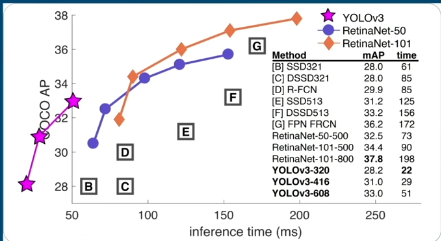

# Traffic Monitoring & Object Detection

https://github.com/user-attachments/assets/4c510ff7-57cc-4899-928a-418b327f64cc

---

## Overview
This project focuses on applying computer vision techniques to analyze a traffic video feed from Dhaka, Bangladesh. The primary goal is to process video frames and detect/label multiple objects (such as cars and people) in real-time. 

To achieve this, I am leveraging a pretrained **YOLO (You Only Look Once)** model. Compared to my previous work on Cassava Disease detection—which focused on classifying a single plant at a time—this new approach detects and localizes multiple objects simultaneously. This methodology is highly applicable in advanced fields such as autonomous vehicles.

---

## Why YOLO? 
For images containing multiple objects, we need to answer two questions: *What are these objects?* and *Where are they located in the image?* YOLO excels at this because of its **speed**. A typical video runs at 30 frames per second (fps). To process video in real-time without lagging, a model must process frames faster than ~30 milliseconds per frame. YOLO consistently outperforms other models in speed comparisons, making it ideal for real-time video inference.

### This plot shows an Inference time comparison between YOLO and other Computer Vision Models

### How YOLO Works
Instead of running a classifier across multiple sections of an image, YOLO looks at the entire image at once:
* It passes the image through **convolutional layers** and **fully connected layers**.
* It divides the image into an **$S \times S$ grid**.
* It simultaneously predicts bounding boxes and probabilities for each grid cell.

---

## Objectives
Throughout this project, I am building expertise in object detection by achieving the following:

* Detect objects in an image using the YOLO model.
* Parse the results and extract data from the YOLO model.
* Display the resulting bounding boxes accurately on the target images.
* Detect objects from a variety of sources, including images stored in local directories.
* Extract frames and detect objects directly from a continuous video source.
* Train YOLO to detect custom objects specifically tailored for traffic analysis.
* Augment data to enhance the model's ability to generalize during training.
* Utilize Python's `pathlib` for efficient file system navigation and management.

---

## YOLO Bounding Box Formats
YOLO supports four primary formats for bounding boxes to make interfacing with different labeling tools and downstream tasks easier. 

| Format | Description |
| :--- | :--- |
| **`xywh`** | Center X, Center Y, Width, Height (Absolute pixel values) |
| **`xywhn`** | Center X, Center Y, Width, Height (Normalized between 0.0 and 1.0) |
| **`xyxy`** | Top-Left X, Top-Left Y, Bottom-Right X, Bottom-Right Y (Absolute pixel values) |
| **`xyxyn`** | Top-Left X, Top-Left Y, Bottom-Right X, Bottom-Right Y (Normalized between 0.0 and 1.0) |

---

## Workflow

**[View a more visual workspace here Part A (N/B give some secs for videos/photos to load)](https://blazinbanana.github.io/Traffic-Monitoring/)**

---

**[View a more visual workspace here Part B (N/B give some secs for videos to load)](https://charming-torte-8a4575.netlify.app/)**

---

## Adding Custom Classes

Building an object detection model for custom classes requires three core components:
1. **Labeled Training Data** 
2. **Model Architecture** (YOLO)
3. **Loss Function Optimization**

Unlike simple image classification (which relies solely on Cross-Entropy), object detection models must account for multiple types of errors simultaneously.

---

### **Understanding Our Loss Functions**
In multiple object detection, the model can make three distinct types of errors. We use specific loss functions to penalize and correct each of these:

| Error Type | What it Means | Assigned Loss Function |
| :--- | :--- | :--- |
| **Missed Object** | The model failed to detect an object that is present. | **Binary Cross Entropy (BCE)** |
| **Wrong Location** | The bounding box does not accurately surround the object. | **Complete Intersection over Union (CIoU)** |
| **Wrong Class** | The object is detected but assigned the wrong label. | **Focal Loss** *(Scaled Multiclass Cross-Entropy)* |

---

### **Core Objectives**
To successfully fine-tune and deploy this model, the following pipeline objectives were met:

* **Data Preprocessing:**
  * Converted existing bounding boxes into the new representation required by the YOLO architecture.
  * Cleanly handled and filtered out malformed data to ensure training stability.
* **Environment Setup:**
  * Assembled the dataset and configuration files into the strict directory structure expected by the YOLO framework.
* **Model Training & Inference:**
  * Fine-tuned the pre-trained model to detect the new, custom traffic-related classes. eg **Ambulance**
  * Ran inference to successfully detect these new classes in unlabelled images.

---

## Current Progress & Milestones Met
* **Data Organization:** Loaded and structured the project dataset, separating raw images from their corresponding XML annotations.
* **Handling Diverse Data Sources:** Successfully integrated both pre-existing image datasets and frames extracted from a YouTube video.
* **XML Parsing:** Built parsers to extract object classifications and bounding box coordinates from XML files.
* **Bounding Box Visualization:** Created visual overlays of bounding boxes on image data to validate detection accuracy.
* **Model Fine-tuning:** The model can now detect the additional classes.

---

## 🛠️ Environment & Tech Stack
* **OS:** Linux
* **Python:** 3.11.0 
* **OpenCV (CV2):** 4.10.0
* **PyTorch:** 2.2.2+cu121
* **Torchvision:** 0.17.2+cu121

---

## ⚖️ Acknowledgments & License

  

    This project file and exploration are licensed under <a href="https://creativecommons.org/licenses/by-nc-nd/4.0/">Creative Commons Attribution-NonCommercial-NoDerivatives 4.0 International</a>.
  

  

    Credit <b>to</b>:
    <ul>
      <li>✓ <a href="https://www.wqu.edu/">WorldQuant University</a> for the foundational curriculum, dataset context, and environment.</li>
      <li>✓ <a href="https://creativecommons.org/licenses/by-nc-nd/4.0/">Review the full License Details here</a>.</li>
    </ul>
  

