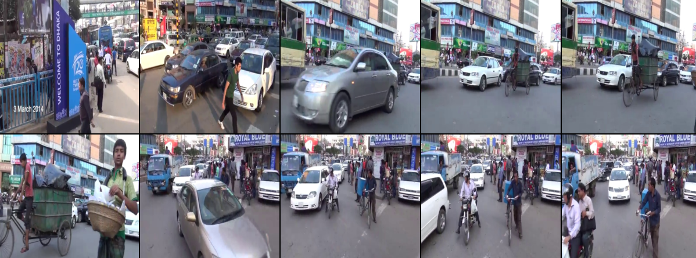

# Traffic Monitoring & Object Detection

**[View the Full Interactive Visual Report Here](https://blazinbanana.github.io/Traffic-Monitoring/)**

## Overview
This project focuses on applying computer vision techniques to analyze a traffic video feed from Dhaka, Bangladesh. The primary goal is to process video frames and detect/label objects (such as cars and people) in real-time. 

To achieve this, I am leveraging a pretrained YOLO (You Only Look Once) model and extending it to detect custom objects specifically tailored for traffic analysis.

## Things I Aim to Master
Throughout this project, I am building expertise in the following areas:
* Extracting frames from video files at regular intervals.
* Working with XML data containing bounding box annotations.
* Applying and fine-tuning the pretrained YOLO object detection model.
* Training YOLO to detect custom objects.
* Augmenting data to enhance the model's ability to generalize during training.
* Utilizing Python's `pathlib` for efficient file system navigation and management.

## Core Concepts Explored
* **Object Detection vs. Classification:** Moving beyond simply classifying an entire image (classification) to identifying and precisely locating multiple objects within a frame (detection).
* **Real-World Challenges:** Handling overlapping objects and partial occlusions in dense traffic feeds.
* **Broader Applications:** While applied to traffic here, these techniques are directly transferable to wildlife monitoring, medical imaging, and more.

## Current Progress & Objectives Met
* **Data Organization:** Loaded and structured the project dataset, separating raw images from their corresponding XML annotations.
* **Handling Diverse Data Sources:** Successfully integrated both pre-existing image datasets and frames extracted from a YouTube video.
* **Video Processing:** Implemented scripts to extract frames from a video feed at regular intervals.
* **XML Parsing:** Built parsers to extract object classifications and bounding box coordinates from XML files.
* **Bounding Box Visualization:** Created visual overlays of bounding boxes on image data to validate detection accuracy.

## 🛠️ Environment & Tech Stack
* **OS:** Linux
* **Python:** 3.11.0 
* **OpenCV (CV2):** 4.10.0
* **PyTorch:** 2.2.2+cu121
* **Torchvision:** 0.17.2+cu121